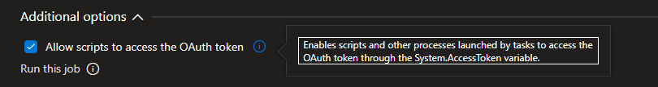
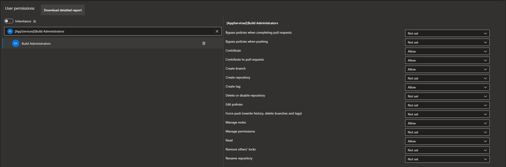

# AI-Assisted Code Review for Azure DevOps

## Elevate Your Code Review Process with AI

Welcome to the **AI-Assisted Code Review DevOps Extension**! Revolutionize your development process by integrating OpenAI’s cutting-edge language models into your Azure DevOps pipeline. Transform your code reviews into a smart, efficient, and insightful process.

### Start Improving Your Code Reviews Today

Supercharge your workflow with AI-powered code reviews. Install the extension now and unlock intelligent, actionable insights for every code change. Embrace the future of code reviews with ease!

## Why Use AI-Assisted Code Review?

- **Automated Code Analysis:** Eliminate manual inspections with AI-driven analysis that detects bugs, performance issues, and suggests best practices automatically.
- **Simple Installation:** Get started quickly with a one-click installation from the [Azure DevOps Marketplace](https://marketplace.visualstudio.com/items?itemName=AeriesSoftware.aeries-ai-assisted-code-review).
- **Intelligent Insights:** Harness advanced natural language processing to receive meaningful feedback on your pull requests.
- **Accelerated Review Cycles:** Save time by letting AI handle routine reviews, so your team can focus on what truly matters.
- **Customizable Settings:** Adapt the extension to your needs by configuring the AI model, file exclusions, additional review prompts, and even the OpenAI API URL.

## Prerequisites

- An [OpenAI API Key](https://platform.openai.com/docs/overview)

## Getting started

1. Install the AI Assisted Code Review DevOps Extension.
2. Add AI Assisted Code Review Task to Your Pipeline:

   ```yaml
   trigger:
     branches:
       exclude:
         - '*'

   pr:
     branches:
       include:
         - '*'

   jobs:
   - job: CodeReview
     pool:
       vmImage: 'ubuntu-latest'
     steps:
     - task: AIAssistedCodeReviewTask@1
       inputs:
         api_key: $(OpenAI_ApiKey)
         ai_model: 'gpt-4' # Specify the model to use
         api_url: 'https://custom-openai-api.com/v1' # Optional: Specify a custom OpenAI API URL
         bugs: true
         performance: true
         best_practices: true
         file_extensions: '.js,.ts,.css,.html'
         file_excludes: 'file1.js,file2.py,secret.txt'
         additional_prompts: 'Fix variable naming, Ensure consistent indentation, Review error handling approach'
   ```

3. If you do not already have Build Validation configured for your branch, add [Build validation](https://learn.microsoft.com/en-us/azure/devops/repos/git/branch-policies?view=azure-devops&tabs=browser#build-validation) to your branch policy to trigger the code review when a Pull Request is created.

## Specifying the AI Model

The `ai_model` input allows you to specify the OpenAI model to use for code reviews. You can choose from supported models like `gpt-4`, `gpt-3.5-turbo`, or any other model supported by OpenAI. If the specified model is not officially supported, a warning will be logged, but the task will proceed.

### Example Usage

To specify the model, include the `ai_model` input in your pipeline configuration:

```yaml
inputs:
  api_key: $(OpenAI_ApiKey)
  ai_model: 'gpt-4' # Replace with the desired model
  bugs: true
  performance: true
  best_practices: true
```

### Notes:
- If the model is not in the list of officially supported models, a warning will be logged, but the task will still attempt to use the specified model.
- Ensure the model you specify is available in your OpenAI account.

## Custom API URL Support

The `api_url` input allows you to specify a custom URL for the OpenAI API. This is useful if you are using a proxy, a custom deployment of the OpenAI API, or an alternative API endpoint. If not provided, the default URL (`https://api.openai.com/v1`) will be used.

### Example Usage

To use a custom API URL, include the `api_url` input in your pipeline configuration:

```yaml
inputs:
  api_key: $(OpenAI_ApiKey)
  api_url: 'https://custom-openai-api.com/v1' # Replace with your custom API URL
  ai_model: 'gpt-4'
  bugs: true
  performance: true
  best_practices: true
```

## Specifying the Maximum Tokens

The `max_tokens` input allows you to configure the maximum number of tokens for the AI model. This parameter ensures that the request stays within the token limit of the selected model, enabling efficient use of different foundation models.

### Example Usage

```yaml
inputs:
  api_key: $(OpenAI_ApiKey)
  ai_model: 'gpt-4'
  max_tokens: '8192' # Specify the maximum tokens limit
  bugs: true
  performance: true
  best_practices: true
```

---

## Enabling Access to Other Foundation Models

To use other foundation models, such as those available through AWS Bedrock, you can integrate with the [Bedrock Access Gateway](https://github.com/aws-samples/bedrock-access-gateway). This gateway provides a unified interface to access models like Amazon Titan, Claude, and others.

### Example Configuration with Bedrock Access Gateway

```yaml
inputs:
  api_key: $(BedrockApiKey)
  api_url: 'https://your-bedrock-access-gateway-endpoint' # Replace with your Bedrock Access Gateway URL
  ai_model: 'amazon.titan-text' # Specify the foundation model available through AWS Bedrock
  max_tokens: '8192'
  bugs: true
  performance: true
  best_practices: true
```

### Why Use Bedrock Access Gateway?
- Access multiple foundation models through a single API.
- Leverage AWS Bedrock for enterprise-grade scalability and security.
- Easily switch between OpenAI and AWS Bedrock models by updating the `api_url` and `ai_model` inputs.

For more information, visit the [Bedrock Access Gateway GitHub repository](https://github.com/aws-samples/bedrock-access-gateway).

## FAQ

### Q: What agent job settings are required?

A: Ensure that "Allow scripts to access OAuth token" is enabled as part of the agent job. Follow the [documentation](https://learn.microsoft.com/en-us/azure/devops/pipelines/build/options?view=azure-devops#allow-scripts-to-access-the-oauth-token) for more details.



### Q: What permissions are required for Build Administrators?

A: Build Administrators must be given "Contribute to pull requests" access. Check [this Stack Overflow answer](https://stackoverflow.com/a/57985733) for guidance on setting up permissions.



### Bug Reports

If you find a bug or unexpected behavior, please [open a bug report](https://github.com/jameslancaster/AI-Assisted-Code-Review/issues/new?assignees=&labels=bug&template=bug_report.md&title=).

### Feature Requests

If you have ideas for new features or enhancements, please [submit a feature request](https://github.com/jameslancaster/AI-Assisted-Code-Review/issues/new?assignees=&labels=enhancement&template=feature_request.md&title=).

## Learn More

Visit our [GitHub repository](https://github.com/jameslancaster/AI-Assisted-Code-Review) for additional documentation, updates, and support.
